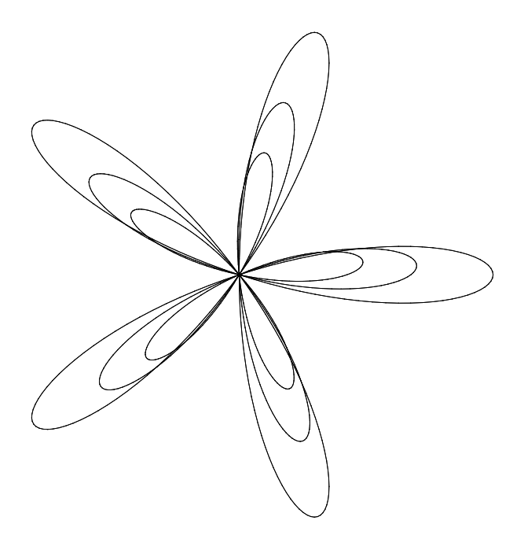
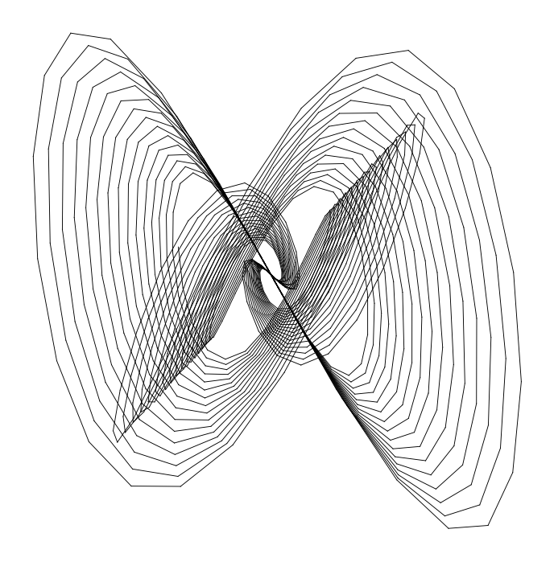
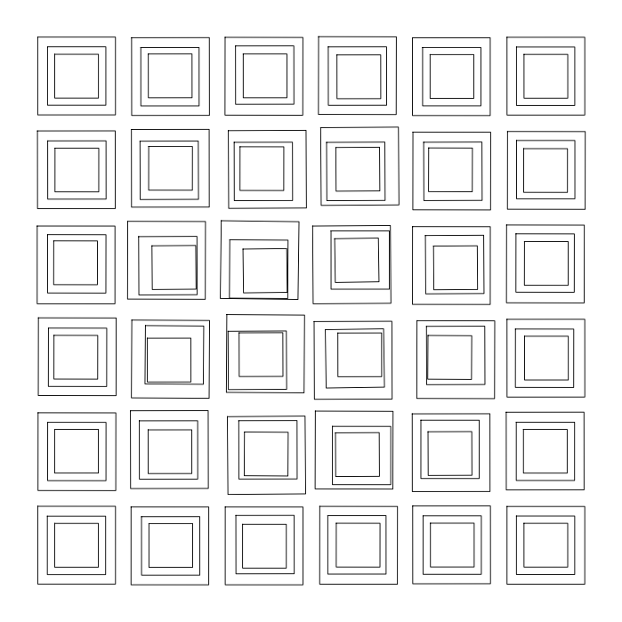
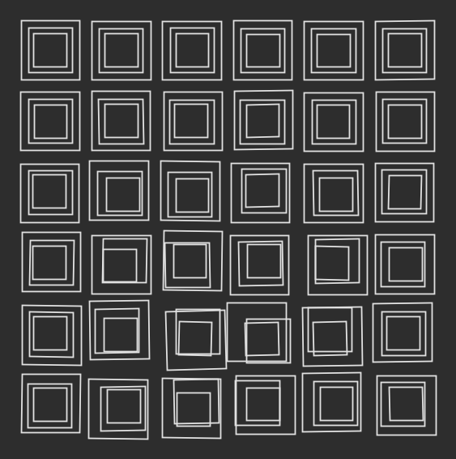

# Gallery

Selected outputs from the code experiments. Images use each sketch's default
parameters and seed; the sources live under `sketches/`.

-   

    ---

    **Rosette**

    Multi-layer parametric rose curve. `sketches/vsketch/rosette/`

-   

    ---

    **Harmonograph**

    Damped dual-pendulum curves. `sketches/vsketch/harmonograph/`

-   

    ---

    **Molnár squares (vsketch)**

    Concentric squares with focus-weighted disorder.
    `sketches/vsketch/molnar_squares/`

-   

    ---

    **Molnár squares (py5)**

    Interactive Processing port with a dark canvas.
    `sketches/processing/molnar_squares/`

